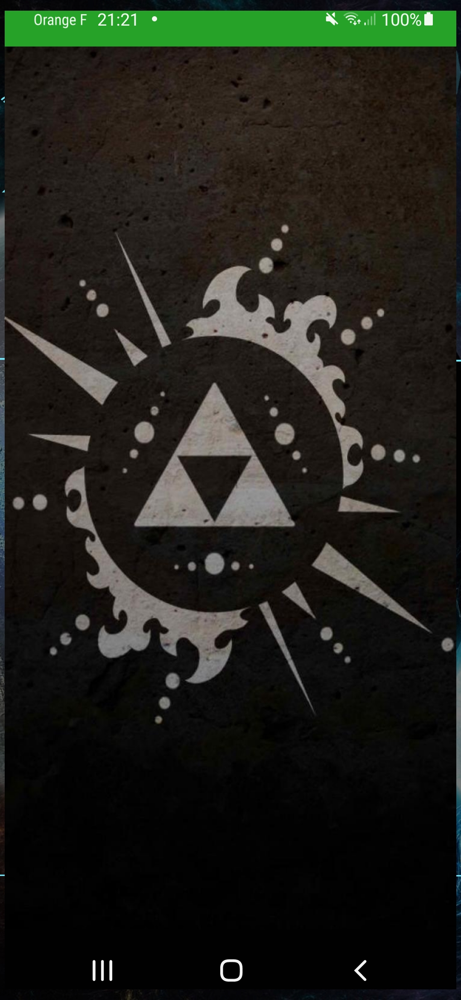
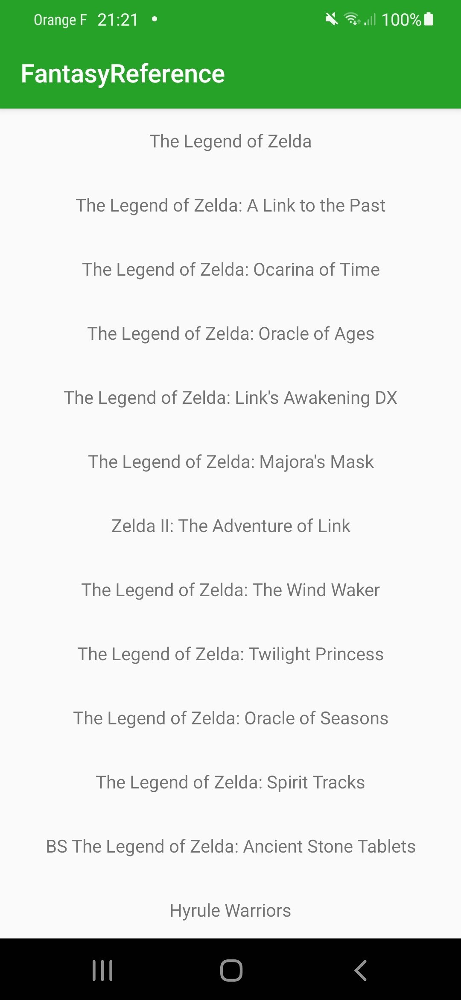
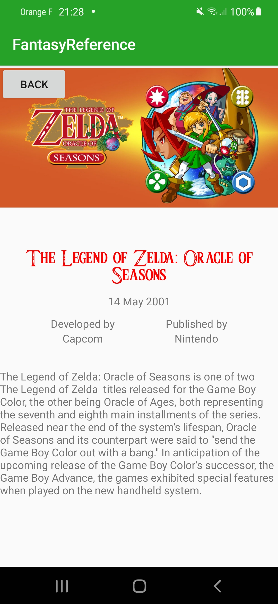

# FantasyReference
An Android wiki for the Legend of Zelda saga.

API: https://docs.zelda-api.apius.cc/

This is a school project from ESIEA, 6th semester

The goal of this project was to create an app that would include the following: 

* A connnection to a REST API
* A list of items, via a RecyclerView
* A screen with element details
* Data storage in cache

## App Behaviour

The app is based around the API given above. It requests the API via internet connection to obtain its informations. Once they have been downloaded, they are displayed on screen to be viewed by the user, and also stored in a Room Database which serves as cache.

The user can click on an item in the list to display more details about the game, like its original release date, producer, developer and a short description.

The application is built around the MVP architecture.

## App Screenshots

Here are a few screenshots taken from the app

### Splash Screen

The splash screen is displayed while the application is loading

### Game List

### Detail screen

## Bug report

If you find any issue with this app, please raise an issue on github at github.com/Zstorm999/FantasyReference

__Disclaimer__ : I am not the creator or owner of the API or any of the images, they all belong to their respective owner. 

